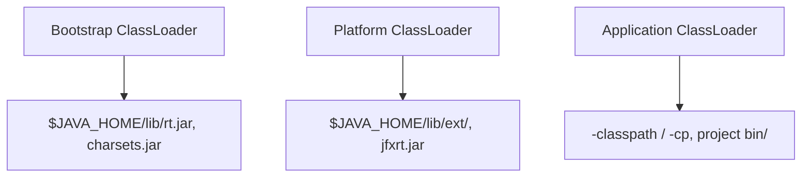
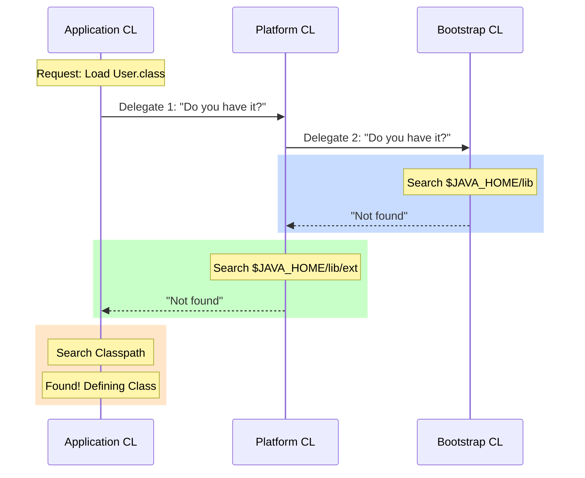
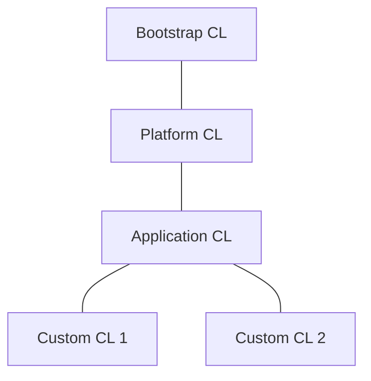
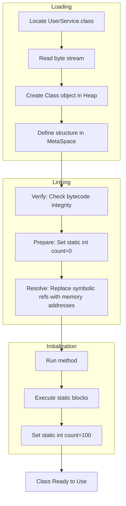

# JVM ClassLoader Deep Dive

The ClassLoader is a fundamental part of the Java Virtual Machine (JVM) responsible for dynamically loading Java classes into memory. It is not a single component but a subsystem that follows strict rules to ensure type safety and system stability.

## 1. The Class Loading Lifecycle

The process of bringing a class into the JVM's runtime environment is divided into three main phases: Loading, Linking, and Initialization.

### 1.1 Loading

Loading is the process of finding the binary representation of a class (usually a `.class` file) and creating a `java.lang.Class` object in the heap.

**Detailed Mechanics:**
The JVM reads the byte stream and defines the class structure in the Method Area (MetaSpace). This includes the constant pool, field data, and method data.

**Example 1: Loading from a JAR File**
When you run a command like `java -cp my-app.jar com.example.Main`, the AppClassLoader searches the ZIP entries of `my-app.jar` matching the package path `com/example/Main.class`. It reads the raw bytes and converts them into the internal JVM format.

**Example 2: Dynamic Proxy Generation**
Libraries like Spring or Hibernate generate classes at runtime. For example, `Proxy.newProxyInstance()` creates a byte array in memory that follows the class file format. This byte array is then passed to a ClassLoader to "load" a class that never existed on disk.

---

### 1.2 Linking

Linking involves preparing the class for execution. It is subdivided into three steps: Verification, Preparation, and Resolution.

#### A. Verification
Binary data is checked for correctness to ensure it doesn't violate JVM security constraints. This is critical for preventing malicious code execution.

**Example 1: Bytecode Integrity**
The verifier checks if every instruction has a valid opcode and if the stack frame size is correct. It ensures that a method doesn't try to pop an empty stack.

**Example 2: Access Control**
It verifies that a class isn't trying to access a `private` member of another class or inherit from a `final` class.

#### B. Preparation
Memory is allocated for **static variables**, and they are initialized to their **default values**.

**Example 1: Default Object Reference**
If you have `static String name = "Huy";`, during Preparation, `name` is set to `null` (the default value for references). The value "Huy" is assigned later during Initialization.

**Example 2: Numeric Defaults**
`static int count = 100;` results in `count` being set to `0` in memory during this phase.

#### C. Resolution
Symbolic references in the constant pool (names of classes, methods, or fields) are replaced with direct references (memory pointers).

**Example 1: Method Invocations**
If `ClassA` calls `ClassB.method()`, the constant pool initially contains the string "ClassB". Resolution finds the actual address of `ClassB` in memory and updates the call site to jump directly to that address.

**Example 2: Field Access**
A field access to `this.id` is resolved from a symbolic name "id" to a specific offset within the object's memory layout.

---

### 1.3 Initialization

Initialization is the phase where the class's **static initializers** and **static assignment blocks** are executed. This is the first time Java code from the class actually runs.

**Example 1: Static Blocks**
```java
public class Database {
    static {
        System.out.println("Connecting to DB...");
        // This runs only when the class is initialized
    }
}
```

**Example 2: Accessing Static Constants**
If a field is `static final int MAX = 10;`, it is resolved during Linking (Preparation) because it is a constant. Accessing it does **not** trigger initialization. However, accessing a `static int version = getVersion();` **will** trigger initialization because the value is calculated at runtime.

---

## 2. Parents Delegation Model

The JVM employs a hierarchical delegation model where a ClassLoader always delegates the search for a class to its parent before searching itself.

### 2.1 The Hierarchy

1. **Bootstrap ClassLoader**: Loads core libraries ($JAVA_HOME/lib/rt.jar). It is written in native code (C++) and acts as the root.
2. **Platform ClassLoader** (formerly Extension): Loads platform-specific extensions ($JAVA_HOME/lib/ext).
3. **Application ClassLoader**: Loads classes from the `java.class.path` (the User Classpath).

### 2.2 Search Paths and Responsibilities



### 2.3 Detailed Delegation Flow

When a class needs to be loaded, the process follows a "Request Up, Load Down" pattern.



### 2.4 Why Delegation?
**Example 1: Security and Object Integrity**
Imagine a developer creates a malicious `java.lang.Object` class. Without delegation, the Application ClassLoader might load the fake one instead of the real one. With delegation, the request goes up to the Bootstrap level which finds the real `java.lang.Object` from the JDK, ensuring the fundamental building block of Java remains untampered.

**Example 2: Class Uniqueness**
By delegating upwards, we ensure that a library shared by multiple modules (like `log4j`) is loaded only once by a common parent, rather than each module loading its own incompatible version.



---

## 3. Custom ClassLoaders and Isolation

Custom ClassLoaders are used to achieve behaviors that standard loaders cannot provide.

**Example 1: Hot-Reloading in Web Servers**
In Tomcat, each web application (WAR file) gets its own `WebappClassLoader`. This allows you to reload one application (by discarding its ClassLoader and creating a new one) without restarting the entire server. Since the classes are loaded by different loaders, they are considered different types even if their names are identical.

```mermaid
graph TD
    CL1[ClassLoader A] --> C1[Loaded: MyClass]
    CL2[ClassLoader B] --> C2[Loaded: MyClass]
    C1 --- X[Not Identical Types]
    C2 --- X
    Note right of X: Type safety through isolation
```

**Example 2: Plugin Architecture**
An IDE or a game might load plugins from a `plugins/` directory. By using a custom ClassLoader for each plugin, you can ensure that `PluginA` cannot accidentally access internal classes of `PluginB`, providing a sandbox environment.

---

## 4. Common ClassLoader Errors

1. **ClassNotFoundException**: Thrown when `Class.forName()` or `loadClass()` is called with a name that doesn't exist in any of the loaders.
   - *Example:* Misspelling `com.mysql.jdbc.Driver` in a config file.
2. **NoClassDefFoundError**: Thrown when a class was available during compilation but cannot be found at runtime.
   - *Example:* Running a compiled app but forgetting to include a depending JAR in the `-classpath` argument.
3. **LinkageError**: Occurs when two ClassLoaders load the same class into the same JVM, creating type conflicts (e.g., trying to cast an object to a class loaded by a different loader).

---

## 5. Full Lifecycle Visualization (Example: UserService)



## Conclusion

Understanding the ClassLoader is essential for debugging JAR conflicts, implementing hot-swap features, and securing Java applications. The combination of the 3-step lifecycle and the Parent Delegation Model provides a robust foundation for modern Java ecosystems.

