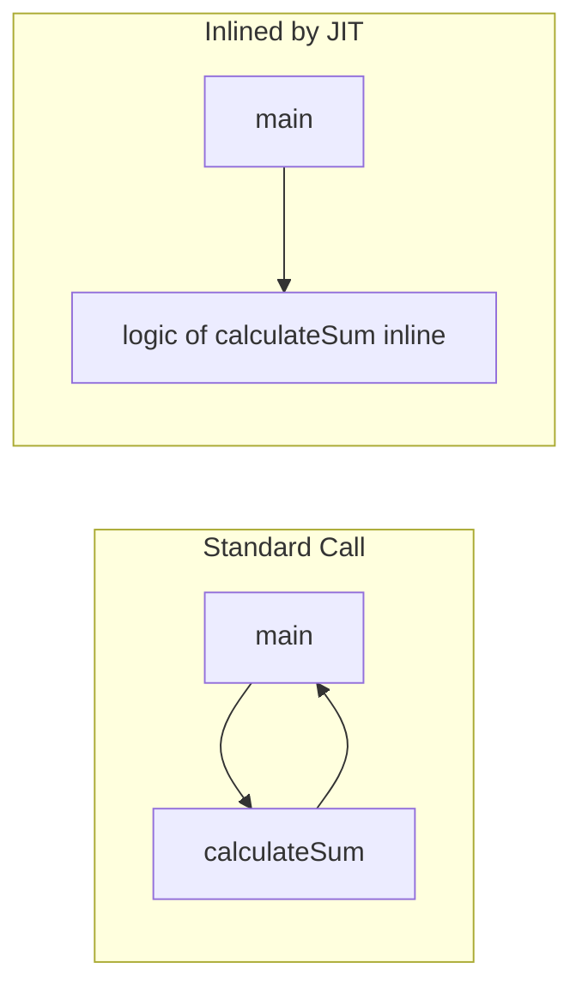
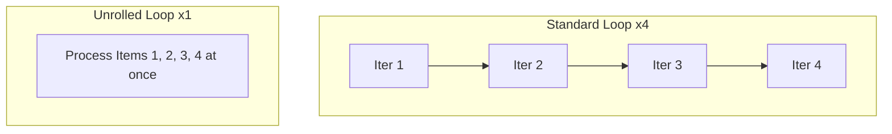
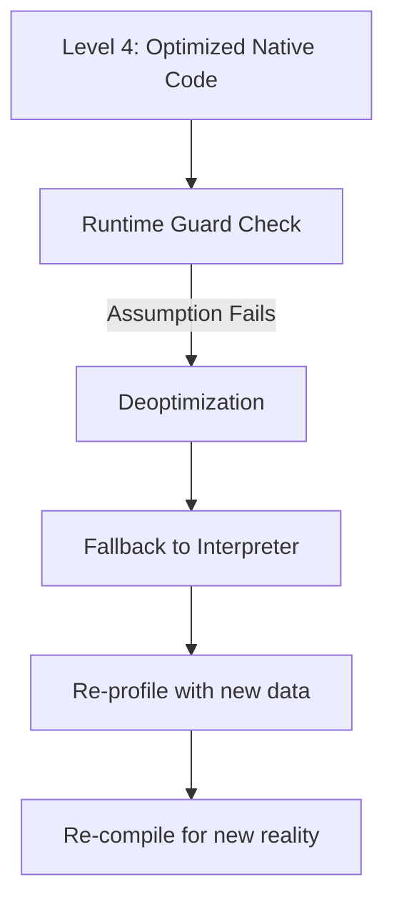
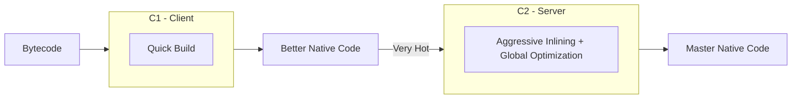
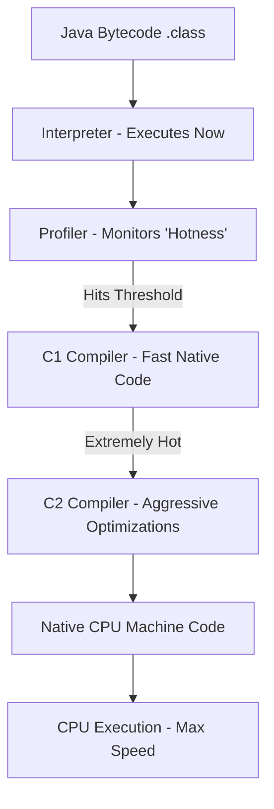

# JVM JIT Compiler: Dynamic Performance Optimization

The Just-In-Time (JIT) compiler is a sophisticated engine within the JVM that bridges the gap between the speed of interpreted code and the peak performance of native machine code. It optimizes the application at runtime by identifying "hot spots" in the code.

---

## 1. Interpreter vs JIT Compiler

The JVM uses a hybrid approach to code execution:

| Stage | Speed | Purpose |
|---|---|---|
| **Interpreter** | Slower (executes bytecode directly) | Immediate startup. No wait for compilation. |
| **JIT Compiler** | Extremely Fast (native CPU code) | High performance for frequently executed code paths. |

**The Workflow**: On startup, the JVM starts interpreting bytecode. This ensures the app launches instantly. Meanwhile, it monitors which parts of the code are being called repeatedly. Once a method crosses a "hotness threshold," the JIT compiler compiles it into native machine code for the local CPU.

---

## 2. Identifying "Hotspots"

The JIT uses two main counters to determine when code should be compiled:
1. **Invocation Counter**: How many times a method has been called.
2. **Back-edge Counter**: How many times a loop index has updated (detects tight loops).

**Example 1: High-Frequency Business Logic**
A `calculateTax()` method in an e-commerce platform is called 10,000 times during a single transaction processing batch. After the 1,500th call (default threshold), the JIT compiles it, making subsequent 8,500 calls much faster.

**Example 2: Heavy Loop Processing**
A video processing application has a loop that iterates 1 million times to filter pixels. Even if the method containing the loop is called only once, the **Back-edge Counter** triggers "On-Stack Replacement" (OSR) to compile that loop in the middle of execution.

---

## 3. Sophisticated Optimizations

The JIT isn't just a basic translator; it applies complex optimizations to the machine code.

#### A. Method Inlining
The overhead of a method call (pushing/popping stack frames) is removed by injecting the logic of the called method directly into the caller.



**Example 1: Setter/Getter Inlining**
```java
// Original
public void update(User user) {
    user.setName("Huy"); // Calls a separate method
}

// Optimized by JIT
public void update(User user) {
    user.name = "Huy"; // Direct assignment, no call overhead
}
```

#### B. Loop Unrolling
The compiler reduces the number of loop jumps by processing multiple entries in a single iteration.



**Example 2: Array Summation**
```java
// Original Loop
for (int i=0; i < 4; i++) sum += arr[i];

// Unrolled by JIT
sum += arr[0];
sum += arr[1];
sum += arr[2];
sum += arr[3]; // Fewer CPU branch predictions needed
```

---

## 4. The Compilation Pipeline (Tiered Compilation)

Modern JVMs use **Tiered Compilation** to balance startup speed and peak throughput:

1. **Level 0**: Pure interpretation.
2. **Level 1-3 (C1 Compiler)**: Quickly compiles code with simple optimizations (Client compiler).
3. **Level 4 (C2 Compiler)**: Deeply optimizes code using profiling data (Server compiler). Only applied to the absolute "hottest" code.

```mermaid
graph LR
    L0[Level 0: Interpreted] --> L1[Level 1: C1 No Profile]
    L0 --> L2[Level 2: C1 Limited Profile]
    L2 --> L3[Level 3: C1 Full Profile]
    L3 --> L4[Level 4: C2 Re-optimize]
    Note over L1,L3: Rapid Startup
    Note over L4: Peak Throughput
```



---

## 5. Tiered Compilation: C1 vs C2

The JVM uses two distinct compilers to balance speed of compilation with code quality.

| Feature | C1 (Client) | C2 (Server) |
|---|---|---|
| **Goal** | Fast startup, low overhead | Max throughput, deep optimization |
| **Optimization** | Simple (Inlining, CSE) | Heavy (Global Data Flow, OSR) |
| **Wait Time** | Very Short | Longer (needs profiling) |



---

## 6. Optimization Visualization



---

## 6. Practical Implications

In the real world, JIT behavior affects how we benchmark and design Java systems:

- **JVM Warm-up**: Java apps often start slower and gradually become faster as the JIT identifies and compiles hot paths. Production systems often "warm up" with fake traffic after a restart to trigger Level 4 compilation.
- **Method Size Limits**: The JIT has a limit on how large a method can be (e.g., 8,000 bytes). If a method is too large, the JIT might refuse to inline or optimize it, causing a silent performance drop.
- **Microbenchmarking**: Using `System.currentTimeMillis()` for a single execution is inaccurate because the code hasn't been optimized by JIT yet. Use tools like **JMH (Java Microbenchmark Harness)** to handle warm-ups correctly.

---

## Conclusion

The JIT Compiler is what makes Java competitive with C++ and Rust in long-running server environments. By dynamically adapting to the "hottest" code paths, it provides maximum performance without sacrificing Java's cross-platform accessibility.
