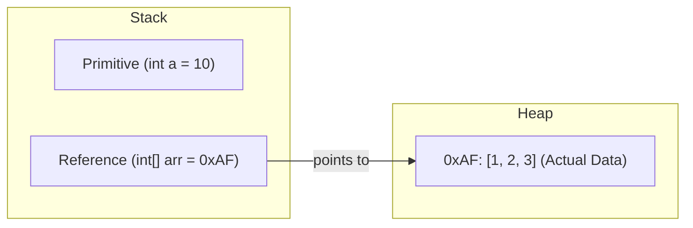
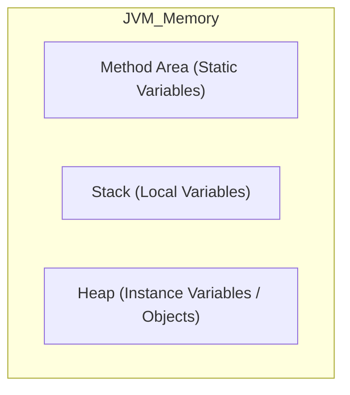
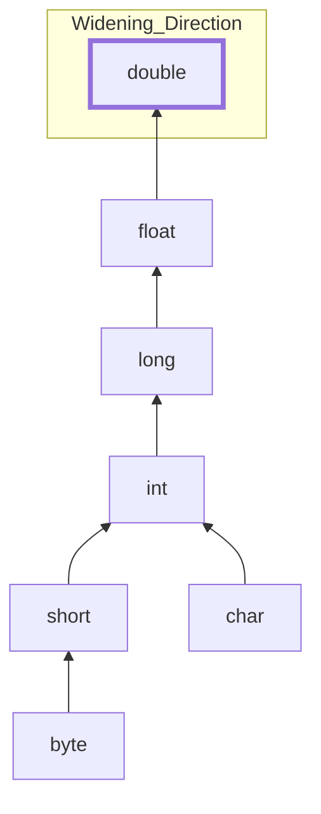

# Java Language Fundamentals: Technical Outline

## 1. Identifiers & Reserved Words
- **Naming Conventions:** Only alphanumeric characters, `_`, and `$`. Must not start with a digit.
- **Reserved Words:** Total 53 predefined keywords (e.g., `native`, `transient`, `volatile`). These names are reserved by the JVM and cannot be used as identifiers.

## 2. Data Types & Memory Allocation (Stack vs Heap)
- **Primitive Types:** 8 total (`byte, short, int, long, float, double, char, boolean`).
    - Fixed memory size (e.g., `int` is always 4 bytes).
    - Values are stored directly in **Stack Memory**.
- **Reference Types:** Classes, Interfaces, Arrays.
    - References (memory addresses) are stored in **Stack Memory**.
    - Actual objects/data live in **Heap Memory**.
    - Managed by the Garbage Collector (GC).

## 3. Literals
- **Numeric Literals:**
    - Binary (`0b`), Hexadecimal (`0x`).
    - Underscore `_` support for readability (e.g., `123_456`).
- **Floating-point:** Default literals are `double`. A suffix `f` is required for `float` values.
- **String Constant Pool:** A special memory area within the Heap used for String literal deduplication.

## 4. Variable Types & Scopes
- **Local Variables:** Declared within a method/block. Must be initialized before access. Stored in Stack.
- **Instance Variables:** Bound to an object. Stored in Heap. Default to `0`, `false`, or `null`.
- **Static Variables:** Bound to a class. Stored in the Method Area (Non-Heap). One shared copy for the entire application.

## 5. Type Casting
- **Implicit Casting (Widening):** Automatic conversion from smaller to larger types (e.g., `byte -> int -> double`). No risk of data loss.
- **Explicit Casting (Narrowing):** Manual conversion from larger to smaller types. Risk of data loss (Overflow/Truncation). Syntax: `(target_type) variable`.

## 6. Arrays (Foundation of Data Structures)
- **Properties:** In Java, an array is an Object. Fixed size after instantiation.
- **Memory Layout:**
    - Single-dimensional: A contiguous block of memory in the Heap.
    - Multi-dimensional: "Arrays of Arrays." Sub-arrays do not require consistent lengths (Jagged Arrays).

---

### Hands-on Coding Task (Fundamentals.java)

1. **Value vs Reference Passing:**
    - Declare `int a = 10` and `int b = a`. Modify `b`. Does `a` change?
    - Declare `int[] arr1 = {1, 2, 3}` and `int[] arr2 = arr1`. Modify `arr2[0]`. Does `arr1[0]` change?
2. **Numeric Overflow:**
    - Cast `int 130` into a `byte`. Explain the resulting value.
3. **Array Manipulation:**
    - Create a 2D "Jagged Array" and iterate through it using nested loops.
