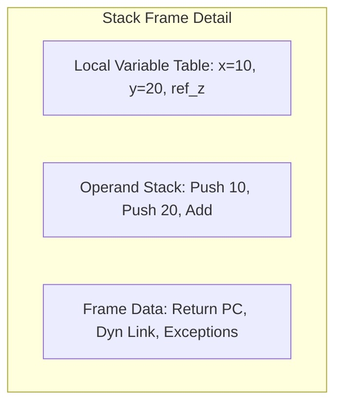
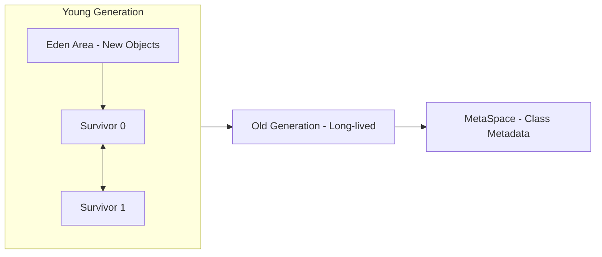
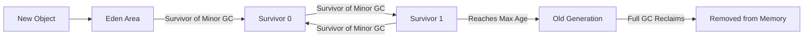
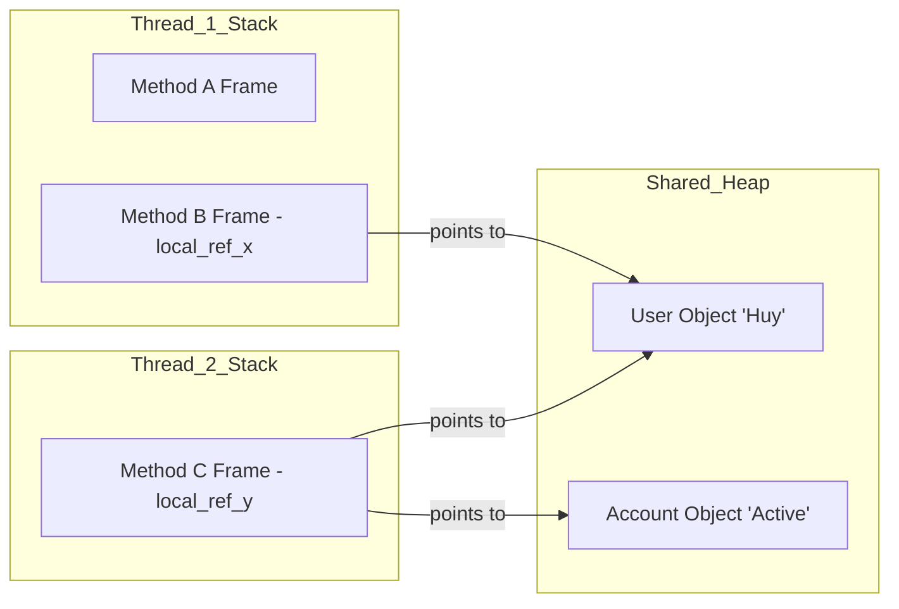

# JVM Memory: Stack vs Heap

Understanding the difference between the Stack and the Heap is crucial for writing efficient Java code and diagnosing memory-related issues like performance bottlenecks or crashes. In the JVM, these two memory areas have distinct purposes, lifetimes, and management rules.

---

## 1. The Stack (Java Virtual Machine Stack)

The Stack is a per-thread memory area that stores temporary data related to method execution. Each time a thread invokes a method, a new **Stack Frame** is created and pushed onto the stack. When the method returns, the frame is popped.

### 1.1 Structure of a Stack Frame
Each frame contains:
1. **Local Variable Table**: Primitive types (`int`, `boolean`, etc.) and object references.
2. **Operand Stack**: Workspace for performing calculations (e.g., adding two numbers).
3. **Frame Data**: Return address, references to the constant pool, and exception dispatch info.



### 1.2 Characteristics
- **Dynamic LIFO**: Last-In, First-Out (LIFO) access.
- **Speed**: Extremely fast due to its simple access pattern.
- **Safety**: Each thread has its own stack, so data is naturally thread-safe.
- **Limited Size**: Controlled by the `-Xss` parameter.

**Example 1: Recursive Method Call**
In a recursive call like `calculateFactorial(5)`, a new frame is pushed for each level ($5, 4, 3, \dots, 1$). If the recursion is too deep (e.g., infinite loop), the stack runs out of space, resulting in a `StackOverflowError`.

**Example 2: Method Logic Execution**
```java
public void compute() {
    int x = 10; // Stored in Local Variable Table of current Frame
    int y = 20; // Stored in Local Variable Table
    int sum = x + y; // Intermediated via Operand Stack
}
```
When `compute()` finishes, its entire Stack Frame (including `x`, `y`, and `sum`) is wiped from memory instantly.

---

## 2. The Heap (Java Heap)

The Heap is the largest memory area in the JVM, shared across all threads. It is used for the runtime allocation of objects.

### 2.1 Object Storage
When you create an object using the `new` keyword, the memory is allocated on the Heap. The local variable on the Stack merely holds a **reference** (pointer) to the object's memory address on the Heap.

### 2.2 Heap Generations
To improve the efficiency of Garbage Collection (GC), the JVM divides the heap into generations:
- **Young Generation**: Where new objects are born. Most objects die here.
- **Old (Tenured) Generation**: Where long-lived objects are moved after surviving multiple GC cycles.





### 2.3 Characteristics
- **Shared Access**: Accessible by all parts of the application. Not inherently thread-safe.
- **Slower Access**: More complex than stack operations.
- **Garbage Collection**: Reclaimed automatically by the GC when no more references point to an object.
- **Flexible Size**: Controlled by `-Xms` (initial) and `-Xmx` (max).

**Example 1: Object Allocation**
```java
User user = new User("Huy"); 
```
- `user`: A reference (pointer) stored in the Stack Frame.
- `new User("Huy")`: The actual object data (name, ID, etc.) resides on the Heap.

**Example 2: GC Trigger**
If `user = null;` is called, the reference in the stack is cleared. The object on the heap becomes "unreachable" and will be reclaimed during the next Minor GC cycle in the Young Generation.

---

## 3. Key Differences at a Glance

| Feature | Stack | Heap |
|---|---|---|
| **Scope** | Per-Thread (Isolated) | Application-wide (Shared) |
| **Object Lifetime** | Lives only until the method returns | Lives until explicitly reclaimed by GC |
| **Storage** | Primitives and References | Full Objects and Class metadata |
| **Access Speed** | Very Fast | Slower (requires pointer dereferencing) |
| **Common Failure** | `StackOverflowError` | `OutOfMemoryError` |
| **Management** | Manual (LIFO) by JVM instructions | Automatic by Garbage Collector |

---

## 4. Interaction Visualization


*In the diagram above, both Thread 1 and Thread 2 can see the 'Huy' object through their local references, while only Thread 2 can see the 'Active' account.*

---

## 5. Troubleshooting Strategy

- **If you see `StackOverflowError`**: 
    - Check for infinite recursion.
    - Check for excessively large local arrays.
    - Increase stack size using `-Xss`.
- **If you see `OutOfMemoryError: Java heap space`**:
    - Check for memory leaks (objects held in a list but never removed).
    - Check for large data sets loaded into memory at once.
    - Increase heap size using `-Xmx`.
